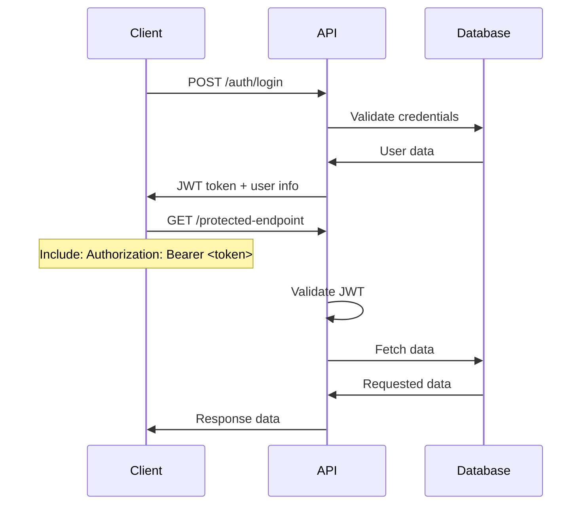

# API Overview

The Civix API provides a comprehensive RESTful interface for all platform operations. Built with Node.js and Express, it serves as the central hub for data management, authentication, and business logic.

## Base URL

```
Development: http://localhost:3000/api
Production: https://your-domain.com/api
```

## Authentication

All protected endpoints require a valid JWT token in the Authorization header:

```bash
Authorization: Bearer <your-jwt-token>
```

### Authentication Flow



## API Response Format

### Success Response
```json
{
  "success": true,
  "data": {
    // Response data
  },
  "message": "Operation completed successfully"
}
```

### Error Response
```json
{
  "success": false,
  "error": {
    "code": "ERROR_CODE",
    "message": "Human readable error message",
    "details": {
      // Additional error details
    }
  }
}
```

## Rate Limiting

| Endpoint Type | Limit | Window |
|---------------|-------|--------|
| Authentication | 5 requests | 15 minutes |
| General API | 100 requests | 15 minutes |
| File Upload | 10 requests | 1 hour |
| Public endpoints | 1000 requests | 15 minutes |

## Endpoint Categories

### 🔐 Authentication Endpoints
- **POST** `/auth/register` - User registration
- **POST** `/auth/login` - User login
- **POST** `/auth/logout` - User logout
- **POST** `/auth/refresh` - Token refresh
- **POST** `/auth/forgot-password` - Password reset request
- **POST** `/auth/reset-password` - Password reset

### 👤 User Management
- **GET** `/users/profile` - Get user profile
- **PUT** `/users/profile` - Update user profile
- **GET** `/users` - List users (admin only)
- **POST** `/users` - Create user (admin only)
- **PUT** `/users/:id` - Update user (admin only)
- **DELETE** `/users/:id` - Delete user (admin only)

### 🎫 ticket/Ticket Management
- **GET** `/tickets` - List all tickets
- **POST** `/tickets` - Create new ticket
- **GET** `/tickets/:id` - Get specific ticket
- **PUT** `/tickets/:id` - Update ticket
- **DELETE** `/tickets/:id` - Delete ticket
- **POST** `/tickets/:id/assign` - Assign ticket to technician
- **PUT** `/tickets/:id/status` - Update ticket status

### 🏛️ Authority Management
- **GET** `/authorities` - List authorities
- **POST** `/authorities` - Create authority
- **GET** `/authorities/:id` - Get specific authority
- **PUT** `/authorities/:id` - Update authority
- **DELETE** `/authorities/:id` - Delete authority

### 🔧 Resolve Requests
- **GET** `/resolve-requests` - List resolve requests
- **POST** `/resolve-requests` - Create resolve request
- **GET** `/resolve-requests/:id` - Get specific resolve request
- **PUT** `/resolve-requests/:id` - Update resolve request status

### 📊 Analytics
- **GET** `/analytics/dashboard` - Dashboard metrics
- **GET** `/analytics/tickets` - Ticket analytics
- **GET** `/analytics/users` - User analytics
- **GET** `/analytics/performance` - Performance metrics

### 📁 File Management
- **POST** `/upload/image` - Upload image
- **DELETE** `/upload/:fileId` - Delete uploaded file
- **GET** `/files/:filename` - Serve uploaded file

### 🏥 System Health
- **GET** `/health` - System health check
- **GET** `/status` - Detailed system status

## Detailed Endpoint Documentation

### Authentication Endpoints

#### Register User
```http
POST /api/auth/register
Content-Type: application/json

{
  "name": "John Doe",
  "email": "john@example.com",
  "password": "securePassword123",
  "role": "citizen"
}
```

**Response:**
```json
{
  "success": true,
  "data": {
    "user": {
      "id": "user_12345",
      "name": "John Doe",
      "email": "john@example.com",
      "role": "citizen"
    },
    "token": "eyJhbGciOiJIUzI1NiIsInR5cCI6IkpXVCJ9..."
  },
  "message": "User registered successfully"
}
```

#### Login
```http
POST /api/auth/login
Content-Type: application/json

{
  "email": "john@example.com",
  "password": "securePassword123"
}
```

**Response:**
```json
{
  "success": true,
  "data": {
    "user": {
      "id": "user_12345",
      "name": "John Doe",
      "email": "john@example.com",
      "role": "citizen"
    },
    "token": "eyJhbGciOiJIUzI1NiIsInR5cCI6IkpXVCJ9..."
  },
  "message": "Login successful"
}
```

### Ticket Management

#### Create Ticket
```http
POST /api/tickets
Authorization: Bearer <token>
Content-Type: application/json

{
  "ticket_name": "Broken Streetlight",
  "ticket_description": "The streetlight on Main St is not working",
  "ticket_category": "Electric ticket",
  "location": {
    "coordinates": {
      "lat": 40.7128,
      "lng": -74.0060
    },
    "address": "123 Main St, New York, NY"
  },
  "urgency": "moderate",
  "image_url": "https://storage.example.com/image123.jpg"
}
```

**Response:**
```json
{
  "success": true,
  "data": {
    "ticket": {
      "id": "ticket_12345",
      "creator_id": "user_12345",
      "creator_name": "John Doe",
      "ticket_name": "Broken Streetlight",
      "status": "open",
      "opening_time": "2025-01-09T10:30:00.000Z",
      "location": {
        "coordinates": { "lat": 40.7128, "lng": -74.0060 },
        "address": "123 Main St, New York, NY"
      }
    }
  },
  "message": "Ticket created successfully"
}
```

#### List Tickets
```http
GET /api/tickets?page=1&limit=10&status=open&category=Electric%20ticket
Authorization: Bearer <token>
```

**Query Parameters:**
- `page` (optional): Page number (default: 1)
- `limit` (optional): Items per page (default: 10, max: 100)
- `status` (optional): Filter by status (open, in_process, resolved)
- `category` (optional): Filter by ticket category
- `urgency` (optional): Filter by urgency level
- `assigned_to` (optional): Filter by assigned technician
- `creator_id` (optional): Filter by ticket creator

**Response:**
```json
{
  "success": true,
  "data": {
    "tickets": [
      {
        "id": "ticket_12345",
        "ticket_name": "Broken Streetlight",
        "status": "open",
        "urgency": "moderate",
        "opening_time": "2025-01-09T10:30:00.000Z"
      }
    ],
    "pagination": {
      "page": 1,
      "limit": 10,
      "total": 25,
      "totalPages": 3
    }
  }
}
```

### User Profile Management

#### Get User Profile
```http
GET /api/users/profile
Authorization: Bearer <token>
```

**Response:**
```json
{
  "success": true,
  "data": {
    "user": {
      "id": "user_12345",
      "name": "John Doe",
      "email": "john@example.com",
      "role": "citizen",
      "points": 150,
      "tickets": ["ticket_12345", "ticket_67890"],
      "created_at": "2025-01-01T00:00:00.000Z"
    }
  }
}
```

#### Update User Profile
```http
PUT /api/users/profile
Authorization: Bearer <token>
Content-Type: application/json

{
  "name": "John Smith",
  "contact": "+1-555-0123"
}
```

### Analytics Endpoints

#### Dashboard Analytics
```http
GET /api/analytics/dashboard
Authorization: Bearer <token>
```

**Response:**
```json
{
  "success": true,
  "data": {
    "summary": {
      "totalTickets": 1250,
      "openTickets": 45,
      "resolvedTickets": 1180,
      "inProcessTickets": 25
    },
    "trends": {
      "dailyReports": [12, 15, 8, 23, 18, 9, 14],
      "resolutionTimes": {
        "average": "4.5 hours",
        "median": "3.2 hours"
      }
    },
    "categories": {
      "Electric ticket": 25,
      "Water": 15,
      "Road maintenance": 30,
      "Sanitation": 10
    }
  }
}
```

## Error Handling

### Common Error Codes

| Code | Description | HTTP Status |
|------|-------------|-------------|
| `VALIDATION_ERROR` | Invalid input data | 400 |
| `UNAUTHORIZED` | Authentication required | 401 |
| `FORBIDDEN` | Insufficient permissions | 403 |
| `NOT_FOUND` | Resource not found | 404 |
| `CONFLICT` | Resource already exists | 409 |
| `RATE_LIMITED` | Too many requests | 429 |
| `SERVER_ERROR` | Internal server error | 500 |

### Error Response Examples

#### Validation Error
```json
{
  "success": false,
  "error": {
    "code": "VALIDATION_ERROR",
    "message": "Validation failed",
    "details": {
      "field": "email",
      "message": "Valid email address is required"
    }
  }
}
```

#### Authentication Error
```json
{
  "success": false,
  "error": {
    "code": "UNAUTHORIZED",
    "message": "Authentication required",
    "details": {
      "reason": "Invalid or expired token"
    }
  }
}
```

## File Upload

### Image Upload
```http
POST /api/upload/image
Authorization: Bearer <token>
Content-Type: multipart/form-data

{
  "image": <file>
}
```

**Response:**
```json
{
  "success": true,
  "data": {
    "filename": "1641727800000_image.jpg",
    "url": "https://storage.example.com/1641727800000_image.jpg",
    "size": 156789
  }
}
```

**Constraints:**
- Maximum file size: 10MB
- Supported formats: JPEG, PNG, WebP
- Images are automatically optimized and resized

## Pagination

All list endpoints support pagination with the following parameters:

```http
GET /api/tickets?page=2&limit=20&sort=created_at&order=desc
```

**Parameters:**
- `page`: Page number (starts from 1)
- `limit`: Items per page (max 100)
- `sort`: Sort field
- `order`: Sort direction (asc/desc)

## Real-time Features

### WebSocket Connection
```javascript
// Connect to WebSocket
const socket = io(process.env.API_URL);

// Listen for ticket updates
socket.on('ticketUpdate', (data) => {
  console.log('Ticket updated:', data);
});

// Listen for new assignments
socket.on('assignmentCreated', (data) => {
  console.log('New assignment:', data);
});
```

### Events
- `ticketCreated`: New ticket reported
- `ticketUpdated`: Ticket status changed
- `ticketAssigned`: Ticket assigned to technician
- `ticketResolved`: Ticket marked as resolved
- `userRegistered`: New user registration

## Security Features

### Input Validation
All endpoints validate input data using Mongoose schemas and custom validators.

### Rate Limiting
API implements intelligent rate limiting based on:
- User role (higher limits for technicians/admins)
- Endpoint type (stricter limits for sensitive operations)
- IP address (additional protection against abuse)

### Security Headers
- `X-Content-Type-Options: nosniff`
- `X-Frame-Options: DENY`
- `X-XSS-Protection: 1; mode=block`
- `Strict-Transport-Security: max-age=31536000`

## Testing the API

### Using cURL

#### Test authentication
```bash
# Register user
curl -X POST http://localhost:3000/api/auth/register \
  -H "Content-Type: application/json" \
  -d '{"name":"Test User","email":"test@example.com","password":"password123","role":"citizen"}'

# Login
curl -X POST http://localhost:3000/api/auth/login \
  -H "Content-Type: application/json" \
  -d '{"email":"test@example.com","password":"password123"}'
```

#### Test protected endpoints
```bash
# Get user profile (replace TOKEN with actual JWT)
curl -X GET http://localhost:3000/api/users/profile \
  -H "Authorization: Bearer TOKEN"

# Create ticket
curl -X POST http://localhost:3000/api/tickets \
  -H "Authorization: Bearer TOKEN" \
  -H "Content-Type: application/json" \
  -d '{"ticket_name":"Test ticket","ticket_description":"Test description","ticket_category":"Electric ticket","urgency":"moderate"}'
```

### Using Postman

Import the [Postman collection](../assets/Civix-API.postman_collection.json) for comprehensive API testing with pre-configured requests and environment variables.

This API documentation provides complete reference for integrating with the Civix platform. For implementation examples, see the [Web Client](../components/web-client.md) and [Mobile App](../components/mobile-app.md) documentation.