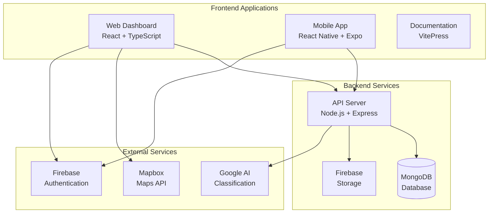

# Components Overview

Civix is architected as a multi-component platform, with each component serving a specific purpose in the civic issue reporting ecosystem. This modular approach ensures scalability, maintainability, and clear separation of concerns.

## Platform Components

### 🖥️ Web Dashboard (`clients/web/`)
**Purpose**: Administrative interface for city officials and managers  
**Technology**: React 19 + TypeScript + Vite 7  
**Users**: City administrators, department heads, supervisors

### 📱 Mobile App (`clients/app/`)
**Purpose**: Citizen-facing application for issue reporting and tracking  
**Technology**: React Native 0.79 + Expo 53  
**Users**: Citizens, field technicians

### 🚀 API Server (`server/`)
**Purpose**: Backend services and data management  
**Technology**: Node.js + Express + MongoDB  
**Consumers**: Web dashboard, mobile app, third-party integrations

### 📚 Documentation (`docs/`)
**Purpose**: Comprehensive documentation and guides  
**Technology**: VitePress 2.0  
**Audience**: Developers, administrators, end users

## Component Architecture



## Component Comparison

| Feature | Web Dashboard | Mobile App | API Server | Documentation |
|---------|---------------|------------|------------|---------------|
| **Purpose** | Admin interface | Citizen app | Backend logic | Knowledge base |
| **Primary Users** | City officials | Citizens | System-wide | Developers/Users |
| **Technology** | React 19 | React Native | Node.js | VitePress |
| **Platform** | Web browsers | iOS/Android | Server | Web |
| **Key Features** | Analytics, Management | Reporting, Tracking | Data, Auth | Guides, API docs |
| **Deployment** | Static hosting | App stores | Cloud server | Static hosting |

## Inter-Component Communication

### API-First Architecture
All components communicate through the central API server, ensuring:
- **Consistency**: Single source of truth for data
- **Security**: Centralized authentication and authorization
- **Scalability**: Components can be scaled independently
- **Flexibility**: Easy to add new components or integrations

### Communication Patterns

#### Web Dashboard ↔ API Server
```typescript
// RESTful API calls with authentication
const response = await fetch('/api/tickets', {
  headers: {
    'Authorization': `Bearer ${token}`,
    'Content-Type': 'application/json'
  }
});
```

#### Mobile App ↔ API Server
```typescript
// React Native fetch with error handling
import api from '@/services/api';

const tickets = await api.get('/tickets');
```

#### Real-time Updates
```javascript
// WebSocket connection for live updates
const socket = io(process.env.API_URL);
socket.on('ticketUpdate', updateTicketInUI);
```

## Technology Stack by Component

### Web Dashboard
```json
{
  "framework": "React 19.1.1",
  "language": "TypeScript 5.8.3",
  "build": "Vite 7.1.2",
  "styling": "Tailwind CSS 4.1.12",
  "routing": "React Router DOM 7.8.2",
  "maps": "Mapbox GL 3.14.0",
  "icons": "React Icons 5.5.0",
  "auth": "Firebase 12.2.1"
}
```

### Mobile App
```json
{
  "framework": "React Native 0.79.6",
  "platform": "Expo 53.0.22",
  "language": "TypeScript 5.8.3",
  "routing": "Expo Router 5.1.5",
  "styling": "NativeWind 4.1.23",
  "navigation": "React Navigation 7.1.6",
  "auth": "Firebase 12.2.1",
  "storage": "Async Storage 2.2.0"
}
```

### API Server
```json
{
  "runtime": "Node.js (Latest LTS)",
  "framework": "Express.js 4.18.2",
  "database": "MongoDB with Mongoose 8.18.0",
  "auth": "JWT 9.0.2",
  "security": "bcrypt 5.1.1, helmet 7.1.0",
  "ai": "Google Generative AI 0.24.1",
  "fileUpload": "Multer 1.4.5",
  "cors": "CORS 2.8.5"
}
```

### Documentation
```json
{
  "framework": "VitePress 2.0.0",
  "theme": "Default theme with customizations",
  "search": "Local search enabled",
  "deployment": "Static site generation"
}
```

## Development Workflow

### Component-Specific Development

#### Web Dashboard Development
```bash
cd clients/web

# Start development server
npm run dev              # http://localhost:5173

# Type checking
npm run build           # Validates TypeScript

# Code quality
npm run lint            # ESLint validation
```

#### Mobile App Development
```bash
cd clients/app

# Start Expo development server
npx expo start

# Web preview
npx expo start --web    # http://localhost:8081

# Platform-specific testing
npx expo start --android
npx expo start --ios
```

#### Backend Development
```bash
cd server

# Development with auto-reload
npm run dev             # Uses nodemon

# Production mode
npm start

# Database seeding
npm run seed
```

#### Documentation Development
```bash
cd docs

# Development server
npm run docs:dev

# Build verification
npm run docs:build
```

### Cross-Component Testing

#### Full Stack Testing
```bash
# Terminal 1: Start backend
cd server && npm run dev

# Terminal 2: Start web dashboard
cd clients/web && npm run dev

# Terminal 3: Start mobile app
cd clients/app && npx expo start --web

# Test data flow across all components
```

## Component Features

### Web Dashboard Features
- **Issue Management**: View, filter, and manage all reported issues
- **Geographic Visualization**: Interactive maps with issue clustering
- **Analytics Dashboard**: Performance metrics and trend analysis
- **User Management**: Manage citizens, technicians, and administrators
- **Assignment System**: Manual and automatic issue assignment
- **Reporting Tools**: Generate reports and export data
- **Real-time Updates**: Live status updates and notifications

### Mobile App Features
- **Issue Reporting**: Camera integration and GPS location
- **User Authentication**: Secure login and registration
- **Issue Tracking**: View personal reported issues
- **Task Management**: For technicians to manage assignments
- **Profile Management**: User settings and preferences
- **Offline Support**: Basic functionality without internet
- **Push Notifications**: Real-time updates on issue status

### API Server Features
- **RESTful API**: Comprehensive endpoints for all operations
- **Authentication**: JWT-based secure authentication
- **Role-based Access**: Different permissions for different user types
- **File Upload**: Secure image upload and storage
- **Data Validation**: Comprehensive input validation
- **Rate Limiting**: Protection against abuse
- **Error Handling**: Consistent error responses
- **Database Management**: Optimized queries and indexing

### Documentation Features
- **Comprehensive Guides**: Setup, development, and user guides
- **API Documentation**: Complete endpoint reference
- **Architecture Docs**: System design and component interaction
- **Search Functionality**: Quick access to information
- **Responsive Design**: Works on all devices
- **Version Control**: Git-based documentation updates

## Performance Characteristics

### Build Times
| Component | Development | Production Build |
|-----------|-------------|------------------|
| Web Dashboard | Instant (HMR) | ~3 seconds |
| Mobile App | ~10 seconds | ~30 seconds |
| API Server | Instant (nodemon) | N/A |
| Documentation | ~3 seconds | ~5 seconds |

### Resource Usage
| Component | RAM Usage | Storage | Network |
|-----------|-----------|---------|---------|
| Web Dashboard | ~50MB | ~2MB built | Low |
| Mobile App | ~100MB | ~50MB installed | Medium |
| API Server | ~150MB | ~20MB | High |
| Documentation | ~30MB | ~5MB built | Low |

## Deployment Strategies

### Independent Deployment
Each component can be deployed independently:

```bash
# Deploy web dashboard
cd clients/web && npm run build && vercel --prod

# Deploy mobile app
cd clients/app && eas build --platform all

# Deploy API server
cd server && vercel --prod

# Deploy documentation
cd docs && npm run docs:build && vercel --prod
```

### Coordinated Deployment
For breaking changes, coordinate deployments:

1. **Deploy API Server** (backwards compatible)
2. **Deploy Web Dashboard** (test integration)
3. **Deploy Mobile App** (submit to stores)
4. **Update Documentation** (reflect changes)

## Component Security

### Web Dashboard Security
- **Content Security Policy**: Prevents XSS attacks
- **HTTPS Only**: All production traffic encrypted
- **Token Validation**: JWT verification on API calls
- **Input Sanitization**: All user inputs validated

### Mobile App Security
- **Secure Storage**: Sensitive data encrypted locally
- **Certificate Pinning**: Prevents man-in-the-middle attacks
- **Biometric Auth**: Optional fingerprint/face recognition
- **App Transport Security**: iOS security compliance

### API Server Security
- **Rate Limiting**: Prevents abuse and DoS attacks
- **CORS Configuration**: Controlled cross-origin requests
- **SQL Injection Prevention**: Mongoose ODM protection
- **Password Hashing**: bcrypt with salt rounds

## Monitoring and Analytics

### Component Health Monitoring
```javascript
// Health check endpoints
GET /api/health           // API server status
GET /health              // Web dashboard status
```

### Performance Metrics
- **Response Times**: API endpoint performance
- **Error Rates**: Component failure rates
- **User Activity**: Feature usage analytics
- **Resource Usage**: Memory and CPU monitoring

## Future Component Evolution

### Planned Enhancements
1. **Microservices**: Break API server into focused services
2. **PWA Features**: Offline support for web dashboard
3. **Desktop App**: Electron-based desktop application
4. **API Gateway**: Centralized API management and routing

### Integration Opportunities
- **IoT Sensors**: Automatic issue detection
- **SMS Gateway**: Alternative reporting channel
- **Payment System**: Fee-based premium services
- **GIS Integration**: Advanced geographic features

This component architecture ensures Civix remains scalable, maintainable, and adaptable to changing requirements while providing a cohesive user experience across all platforms.